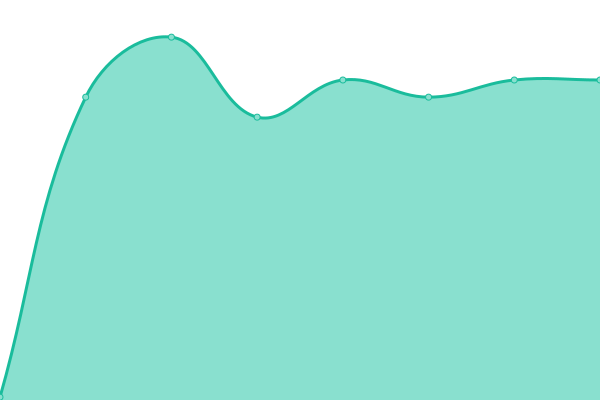
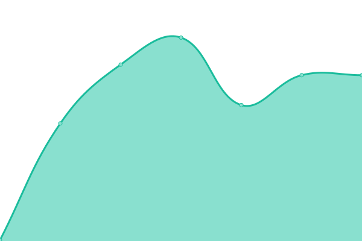

# [📈 Live Status](https://travisnguyen20.github.io/conductify_uptime): <!--live status--> **🟩 All systems operational**

This repository contains the open-source uptime monitor and status page for [Conductify AI](https://conductify.ai), powered by [Upptime](https://github.com/upptime/upptime).

With [Upptime](https://upptime.js.org), you can get your own unlimited and free uptime monitor and status page, powered entirely by a GitHub repository. We use [Issues](https://github.com/travisnguyen20/conductify_uptime/issues) as incident reports, [Actions](https://github.com/travisnguyen20/conductify_uptime/actions) as uptime monitors, and [Pages](https://travisnguyen20.github.io/conductify_uptime) for the status page.

<!--start: status pages-->
<!-- This summary is generated by Upptime (https://github.com/upptime/upptime) -->
<!-- Do not edit this manually, your changes will be overwritten -->
<!-- prettier-ignore -->
| URL | Status | History | Response Time | Uptime |
| --- | ------ | ------- | ------------- | ------ |
|  [Conductify Studio](https://studio.conductify.ai) | 🟩 Up | [conductify-studio.yml](https://github.com/ConductifyAI/conductify-status/commits/HEAD/history/conductify-studio.yml) | 

 245ms
     
 | 

<a href="https://status.conductify.ai/history/conductify-studio">99.30%</a>
    

|  [Conductify Studio API](https://api.conductify.ai/health/liveness) | 🟩 Up | [conductify-studio-api.yml](https://github.com/ConductifyAI/conductify-status/commits/HEAD/history/conductify-studio-api.yml) | 

 167ms
     
 | 

<a href="https://status.conductify.ai/history/conductify-studio-api">61.31%</a>
    

<!--end: status pages-->

[**Visit our status website →**](https://travisnguyen20.github.io/conductify_uptime)

## 📄 License

- Powered by: [Upptime](https://github.com/upptime/upptime)
- Code: [MIT](./LICENSE) © [Anand Chowdhary](https://anandchowdhary.com), supported by [Pabio](https://pabio.com)
- Data in the `./history` directory: [Open Database License](https://opendatacommons.org/licenses/odbl/1-0/)
